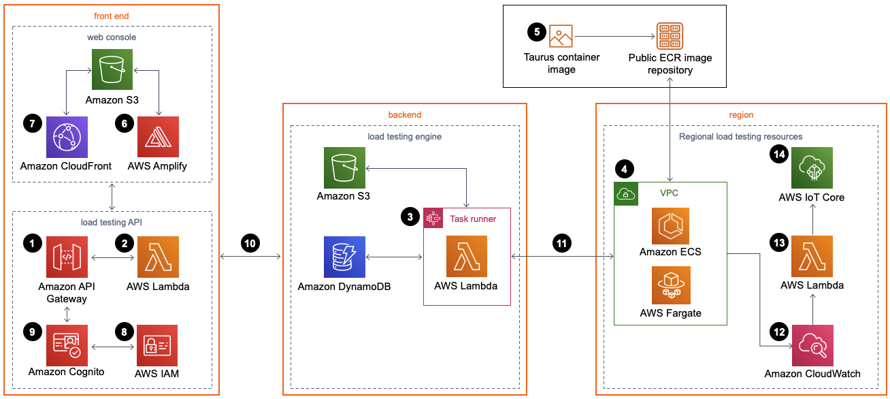

# **Distributed Load Testing on AWS**

## **Overview**
This repository documents my experience using **AWS Distributed Load Testing** to evaluate the load capacity of a website. The **CloudFormation template** was used to deploy a scalable load testing environment, leveraging **AWS Fargate, Amazon ECS, API Gateway, Lambda, DynamoDB, and S3**. This solution enabled me to simulate thousands of concurrent users, analyze response times, and identify potential performance bottlenecks.

## **Key Features**
- **Scalable Load Testing**: Simulates concurrent users generating transactional requests to test website performance.
- **Real-Time Monitoring**: Uses **Amazon CloudWatch** for live test monitoring and performance tracking.
- **Automated Deployment**: Deployed using **AWS CloudFormation** with minimal manual setup.
- **Multi-Region Support**: Enables distributed testing across multiple AWS regions.

## **Architecture**

The **Distributed Load Testing on AWS** solution follows a **serverless architecture** utilizing:
- **Amazon API Gateway**: Handles API requests for test execution.
- **AWS Lambda**: Executes business logic for managing test scenarios.
- **Amazon ECS on AWS Fargate**: Runs test execution containers.
- **Amazon DynamoDB**: Stores test configurations and results.
- **Amazon S3**: Stores test scenarios and results files.
- **Amazon CloudWatch**: Monitors test execution logs and performance metrics.

## **Usage**
### **1. Deploy the CloudFormation Template**
Use the AWS **CloudFormation console** or AWS CLI to deploy the template and set up the testing infrastructure.

### **2. Configure Test Scenarios**

- Access the **web console** generated by CloudFormation.
- Define the test parameters (e.g., number of concurrent users, request frequency, and duration).
- Upload **JMeter scripts** if needed.

### **3. Execute Load Tests**
- Start tests manually via the web console or schedule them for automated execution.
- Monitor test progress in **Amazon CloudWatch**.

### **4. Analyze Results**
- View **average response time, error rates, and successful requests** in the test summary.

- Optimize website performance based on test insights.

## **Prerequisites**
- **AWS Account** with necessary permissions.
- **IAM Roles** configured for CloudFormation deployment.
- **Amazon Cognito** for user authentication.

## **Resources & References**
- AWS Distributed Load Testing Solution: [AWS Official Guide](https://aws.amazon.com/solutions/implementations/distributed-load-testing-on-aws/)
- AWS CloudFormation Documentation: [AWS Docs](https://docs.aws.amazon.com/AWSCloudFormation/latest/UserGuide/)
- JMeter User Manual: [JMeter Docs](https://jmeter.apache.org/usermanual/index.html)

## **License**
Distributed Load Testing on AWS is licensed under the [Apache License 2.0](https://www.apache.org/licenses/LICENSE-2.0).

---
Feel free to fork and contribute! 🚀
